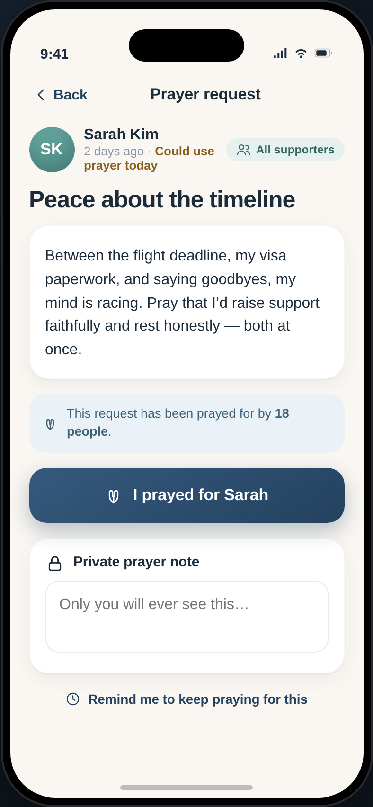
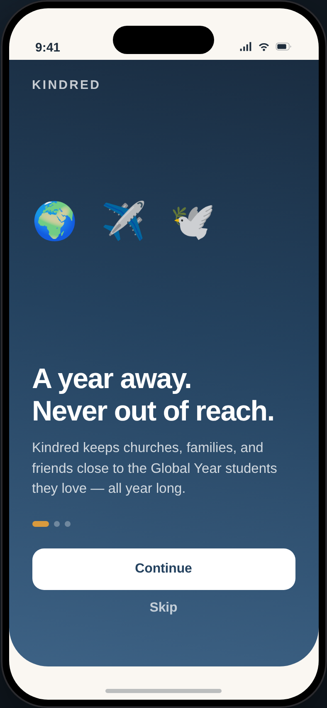

# Kindred — a support network for Global Year students

> *"No Global Year student should feel unseen, unsupported, or forgotten while they are away from home."*

Kindred is a premium, native-feeling iOS app concept that gives churches, families, friends, and mentors a respectful, clear way to stay connected to specific [Global Year](https://www.globalyear.org) students — to understand what they're experiencing, pray for them, respond to practical needs, celebrate milestones, and offer ongoing encouragement throughout their year abroad.

It is **not** a church directory, a social feed, or a fundraising platform. It is a private support ecosystem built around each individual student, with the student in control of every piece of their story.

## What's in this repo

### 🎨 Interactive prototype — [`prototype/`](prototype/)

A fully clickable, high-fidelity prototype of the iPhone app. **No build step** — open it directly:

```
open prototype/index.html        # or double-click it in any modern browser
```

The demo panel beside the phone lets you:

- **View as** six personas: two supporters with different circle access, a brand-new supporter (empty states), two students (one thriving, one homesick), and a church coordinator.
- **Run 7 guided journeys** — urgent prayer, meeting a need, a family-only update, coordinated care, an answered prayer, a scheduled birthday note, and a wellbeing check-in that reaches a mentor.
- **Jump to key flows** — onboarding, profile setup, invites, circles, the Encouragement Wall, milestones, notifications, privacy, safety escalation, the coordinator dashboard, and need creation.

The circle-based privacy model is *actually implemented*: switch personas and watch family-only updates and sensitive prayer requests appear and disappear.

### 📐 Design documentation — [`docs/`](docs/)

| Doc | Contents |
|---|---|
| [01 · Product rationale](docs/01-product-rationale.md) | Why every design decision keeps the student at the center |
| [02 · Sitemap & screens](docs/02-sitemap.md) | Complete app sitemap and the 23-screen inventory |
| [03 · User roles](docs/03-user-roles.md) | Role map and the full permissions matrix |
| [04 · Data model](docs/04-data-model.md) | Core entities, the visibility system, and API-shape recommendations |
| [05 · Design system](docs/05-design-system.md) | Color, typography, spacing, icons, components, and all UI states |
| [06 · Notification strategy](docs/06-notification-strategy.md) | Every notification type, its trigger, cadence, and anti-manipulation rules |
| [07 · Accessibility](docs/07-accessibility.md) | Dynamic Type, contrast, VoiceOver, haptics, and reduced motion |
| [08 · Prototype guide](docs/08-prototype-guide.md) | Personas, seeded content, and step-by-step journey scripts |

## A first look

| Supporter home | Student profile | Prayer detail | Wellbeing check-in |
|---|---|---|---|
|  |  |  |  |

| Student home | Need detail | Coordinator dashboard | Onboarding |
|---|---|---|---|
|  |  |  |  |

## Grounding

The concept is grounded in the real Global Year program (globalyear.org): a Christian gap year sending 18–25-year-olds to locations like Guatemala, Cape Verde, Mexico, Italy, and Southeast Asia for language school, discipleship, cultural immersion, and ministry through the local church. Students are faith-supported and raise their own support (~$13,500–$15,500 for the year) — which is exactly why a coordinated, dignity-preserving support network matters.

The "Just Ask" product direction informed one principle used throughout: **a need that is visible and specific gets met; a need that is vague or hidden does not.** Kindred applies that to needs, prayer, and encouragement alike — while keeping the student, never the ask, at the center.
